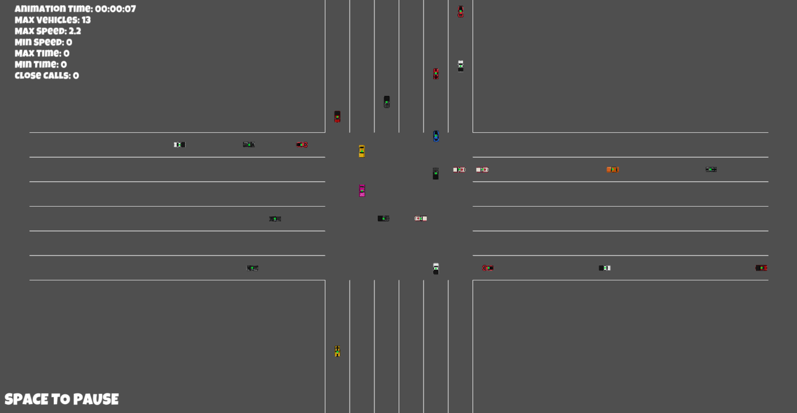
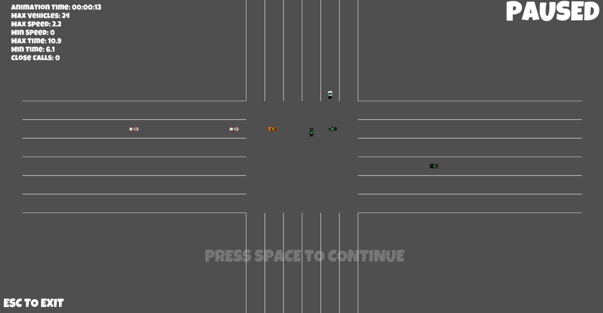

<!-- ctrl + shift + v to preview -->
# smart-intersection

## Table of Contents
- [smart-intersection](#smart-intersection)
  - [Table of Contents](#table-of-contents)
  - [General Information](#general-information)
  - [Features](#features)
  - [Technologies Used](#technologies-used)
  - [Team \& My Work](#team--my-work)
  - [Main Learnings](#main-learnings)
  - [Setup](#setup)
  - [Images](#images)

## General Information
This project was made as a school project in [kood/Jõhvi](https://kood.tech/) (12.10.2022)

The project required us to create a smart intersection simulation.

  **NB! Different source control platform was used hence no commit history.**


## Features
- Beautiful GUI
- Keyboard controls
- Smart intersection with statistics

## Technologies Used
[Rust](https://www.rust-lang.org/)

[Macroquad](https://macroquad.rs/)

## Team & My Work
In this project I was in a team of 2 with 1 other student from kood/Jõhvi.

I was responsible for:
  - Creating the OOP classes
  - The overall lifecycle of the game
  - UI/UX Design
  - Making the main game loop
  - Source code structure
  - Project management

## Main Learnings
- Basics of Rust, Rust OOP
- GUI application using Rust

## Setup
Clone the repository
```
git clone https://github.com/JesusKris/smart-intersection.git
```
Run the application using Rusts official package management cargo
```
cargo run
```
Controls
```
Arrow keys - Spawn a car from corresponding lane
R - Spawns cars from random directions
Space - Pauses the game
Esc - Exits the game during a pause state
```


## Images


